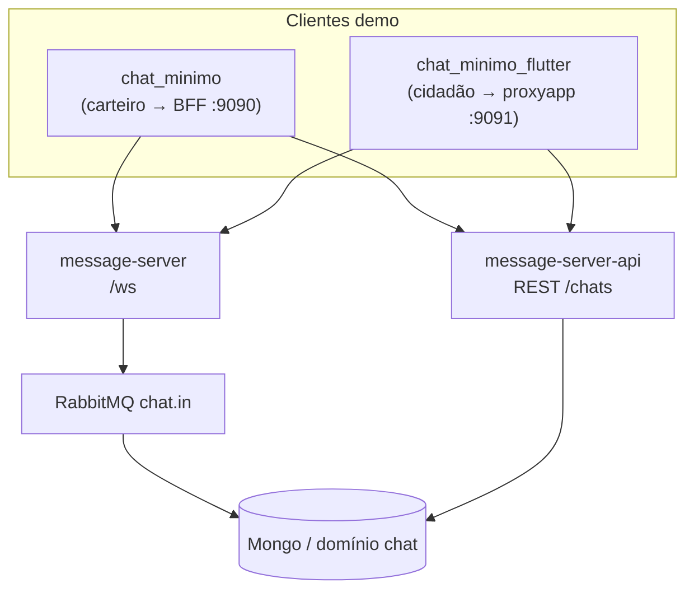

# Documento técnico — estrutura do chat (estado atual)

Este texto descreve a arquitetura do chat de demonstração usada nos projetos **chat_minimo** (Android/Kotlin), **chat_minimo_flutter**, **message-server** (WebSocket e roteamento) e **message-server-api** (REST e persistência). Os caminhos de código citados são relativos a cada repositório.

---

## 1. Visão geral

### 1.0 Fluxo operacional de teste (evolução para produção)

Ordem esperada no negócio:

1. **Carga de contexto LOEC** (tela / fluxo operacional do carteiro, fora destes demos mínimos).
2. **Resolução do idCorreios a partir do objeto** (rastreamento / serviços Correios — ainda não acoplado aos apps demo; hoje os IDs são fixos).
3. **App do carteiro** (`chat_minimo` Kotlin): cria ou resolve sessão via API quando necessário e envia a **primeira mensagem** no WebSocket.
4. **App do cidadão** (`chat_minimo_flutter`): **não** chama `POST /chat/sessoes` para abrir atendimento; só consome **lista** (`POST .../historico` por idCorreios) e abre conversas **já existentes** pela lista. Respostas e leitura seguem o fluxo atual (WS + `markAllRead` opcional).

Os demos mantêm `codigosObjeto` e IDs hardcoded até existir integração real com LOEC e lookup por objeto.

---

O chat combina dois canais:

| Canal | Responsável | Função |
|--------|-------------|--------|
| **REST** | `message-server-api` | Criar/resolver sessão de chat (`chatId`), listar histórico persistido |
| **WebSocket** | `message-server` | Mensagens em tempo quase real, confirmações de entrega/leitura (`messageStatus`), heartbeat |

A persistência assíncrona das mensagens que passam pelo roteador ocorre via fila **RabbitMQ** (`chat.in`), consumida pela API/camada de dados (Mongo).

---

## 2. message-server (WebSocket e roteamento)

- **Protocolo:** WebSocket reativo (Spring WebFlux), **sem** STOMP/SockJS.
- **Endpoint:** `GET /ws?userId=<id>` — o parâmetro `userId` é obrigatório no handshake; sem ele a conexão é encerrada.
- **Saída:** stream por usuário com merge de eventos; inclui heartbeat periódico **`{"type":"PONG"}`** (~20 s).

### 2.1 Roteamento (`MessageRouterService`)

1. Texto recebido no socket é interpretado como JSON.
2. Se for **`messageStatus`**, o destino vem de `targetUserId` ou fallback em `receiver`; o servidor encaminha o status ao peer adequado.
3. Caso contrário, o payload é parseado como mensagem de chat; o `sender` pode ser preenchido com o `userId` da sessão WebSocket se vier vazio.
4. Entrega: tenta **`SessionManager.emitIfConnected(receiver, payload)`**; se não houver sessão para o `receiver` lógico, resolve um **gateway** sintético e tenta entregar a **`__gateway__:<id>`**.

**Gateways (configuráveis, valores típicos em local):**

- Prefixos em `app.chat.gateway-bff-receiver-prefixes` (padrão histórico: `matricula`) → encaminhar para **`__gateway__` + `gateway-bff-id`** (ex.: BFF operacional).
- Demais receivers → **`__gateway__` + `gateway-proxy-id`** (ex.: **proxyapp** no fluxo cidadão).

O perfil Spring **`local,bffunified`** (arquivo `application-bffunified.yaml` no `message-server`) pode expandir prefixos para **`matricula,idCorreios`** quando nativo e Flutter devem usar o **mesmo** WebSocket do BFF (e não o proxy).

Após entrega bem-sucedida, se a mensagem trouxer `msgId`, `chatId` e `sender`, o servidor pode emitir **`messageStatus`** com **`RECEBIDA`** de volta ao remetente e publicar isso na fila de persistência.

**Importante:** neste repositório **não** existem controllers HTTP de chat; apenas WebSocket + fila.

---

## 3. message-server-api (REST)

Base típica **no servidor** (processo JVM da API): **`http://<host>:9641`**.  
**Apps Android/Flutter não chamam essa porta:** cidadão usa **proxyapp** (`:9091`); carteiro (Kotlin) usa **BFF** (`:9090`), e só o BFF/proxy encaminham para a API.

### 3.1 Endpoints principais (`ChatSessionController`, prefixo `/chats`)

| Método | Caminho | Uso no demo |
|--------|---------|-------------|
| `POST` | `/chats/historico` | `idCorreios` **ou** `carteiroId` + `codigosObjeto` — cidadão por idCorreios; carteiro por matrícula |
| `POST` | `/chats` | Cria chat se o histórico não trouxer sessão aberta |
| `GET` | `/chats/{id}/messages` | Carrega mensagens para popular a UI antes/paralelo ao WS |

Há também rotas legadas sob `/chat/...` em `ChatController` (histórico por usuários); o fluxo mínimo atual dos apps demo usa **`/chats/...`**.

---

## 4. Cliente Android — chat_minimo (Kotlin)

**Pacote:** `com.example.chat_minimo_kotlin`

### 4.1 Organização

| Arquivo / pasta | Papel |
|-----------------|--------|
| `MainActivity.kt` | Orquestra OkHttp, WebSocket, bootstrap e handlers |
| `ChatSessionCache.kt` | Cache em memória (processo) da chave `(idCorreios, codigosObjeto ordenados, carteiroId)` → `chatId` |
| `ChatSessionBootstrap.kt` | `POST /chat/historico` e, se necessário, `POST /chat/sessoes` no **BFF** (equivalente a `/chats/...` na API) |
| `ChatHistoryApi.kt` | `GET /chat/sessoes/{id}/messages` no BFF + normalização de linhas |
| `states/ChatState.kt` | Lista reativa de mensagens (`Map<String, Any?>`) para Compose |
| `ui/pages/ChatScreen.kt`, `ChatBubble.kt` | UI |

Não há data classes dedicadas: payloads são **`Map<String, Any?>`** serializados com **Gson**.

### 4.2 Papéis no demo

- **`userId`:** **carteiro** / matrícula — WebSocket, `markAllRead`, lista via `POST /chat/historico` com **`carteiroId`**.
- **`idCorreiosCidadao`:** cidadão alvo no demo (peer na conversa); em produção viria da **busca por objeto** após LOEC.
- **HTTP:** **BFF** `http://<host>:9090` (`/chat/...`). **WebSocket:** mesmo host, `ws://...:9090/ws?userId=<matrícula>`.

### 4.3 Fluxo ao abrir a tela (lista → conversa)

1. Lista: `POST /chat/historico` com `carteiroId` + `codigosObjeto`.
2. Ao escolher um chat: `GET` mensagens por `chatId`; **não** há bootstrap cidadão — quem **cria** sessão no produto é o fluxo **carteiro** (futuro: após LOEC + idCorreios resolvido).
3. WebSocket com reconexão (~3 s).

### 4.4 Envio e recebimento (WebSocket)

- **Enviar:** JSON do mapa da mensagem via `webSocket.send`; eco local na lista em caso de sucesso; linha de sistema em falha.
- **Receber:** ignora `PONG`; atualiza `recebida`/`visualizada` por `msgId`+`chatId` em `messageStatus`; demais mensagens (não eco do próprio `userId`) são enriquecidas, anexadas ao estado e disparam ack **`VISUALIZADA`** uma vez por `msgId`.

---

## 5. Cliente Flutter — chat_minimo_flutter

**Entrada:** `lib/main.dart` instancia `ChatPage` com host derivado de `DEMO_HOST` ou plataforma (`10.0.2.2` no Android, `127.0.0.1` no desktop).

### 5.1 Portas e papéis

- **REST + WS:** `http(s)://<host>:9091` e `ws://<host>:9091` via **proxyapp** (cidadão não fala com a API na 9641).
- **`userId`:** **idCorreios** (lista por cidadão, remetente nas mensagens do app cliente).
- **`receiverId`:** matrícula do carteiro (`receiver` ao responder).
- **`ChatPage`:** só carrega conversa com **`initialChatId`** vindo da lista; **não** chama `ensureOpenChatId` / criação de sessão (o cidadão não inicia o chat).

### 5.2 Componentes

| Arquivo | Papel |
|---------|--------|
| `chat_page.dart` | Estado da lista, bootstrap, integração com `WebSocketService` e `ChatHistoryApi` |
| `chat_session_cache.dart` | Cache estático em memória por mesma chave composta do Kotlin |
| Serviços (ex.: `web_socket_service`, `chat_history_api`) | Canal tempo real (`web_socket_channel`) e HTTP (`http`) |

Reconexão WebSocket com fila de envio enquanto offline e atraso (~2 s) entre tentativas.

### 5.3 Coerência com o roteamento

Se o Flutter usar **proxy (9091)** e o `receiver` for `matricula_*`, o message-server tende a encaminhar ao gateway do **proxy**. Se usar **9090** com `receiver` `idCorreios_*`, as regras de prefixo no YAML determinam se o próximo salto é BFF ou proxy. Ajustar **`APP_CHAT_GATEWAY_BFF_RECEIVER_PREFIXES`** e o perfil **`bffunified`** conforme o cenário (ver comentários em `application-local.yaml` no `message-server`).

---

## 6. Contratos de mensagem (resumo)

Os clientes trabalham com JSON flexível (mapas). Campos frequentes em mensagens de chat:

- `msgId`, `chatId`, `sender`, `receiver`, `content`, `timestamp`
- Flags de UI / domínio: `recebida`, `visualizada` (podem ser atualizadas via `messageStatus`)

**`messageStatus`:** tipo discriminador (ex.: `type: "messageStatus"`), `deliveryStatus` (ex.: `RECEBIDA`, `VISUALIZADA`), referência a `msgId`/`chatId` e alvo (`targetUserId` ou `receiver`).

---

## 7. Ferramentas auxiliares

- **message-audit-panel** (Next.js): painel que pode consultar a API de auditoria (`ChatOutAuditController` e rotas proxy em `app/api/ms/...`) para inspecionar payloads — útil para depuração, não faz parte do runtime mínimo do chat no dispositivo.

---

## 8. Limitações e observações do estado atual

- **LOEC** e **lookup idCorreios por objeto** ainda não estão implementados nos demos; apenas documentados como fluxo alvo.
- O **Kotlin** ainda não chama `POST /chat/sessoes` no `MainActivity` (lista + abrir chat existente); a criação explícita fica para quando integrar LOEC (ou via `ChatSessionBootstrap` em fluxo dedicado).
- IDs, URLs e listas de objetos estão **fixos ou por define** nos demos; não há tela de configuração.
- Cache de `chatId` é **só em memória**; reinício do app refaz bootstrap (histórico HTTP continua sendo buscado após resolver `chatId`).
- O manifest do Android deve permitir rede (incl. **`INTERNET`**) e, em dev, cleartext conforme `networkSecurityConfig` / `usesCleartextTraffic`.

---

*Documento gerado com base na estrutura dos repositórios no workspace (março/2026). Ajuste portas, hosts e perfis Spring conforme o ambiente de deploy.*
