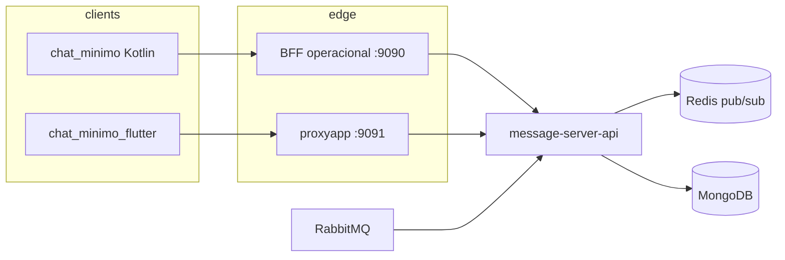

# Documento técnico — estrutura do chat (arquitetura v3 + coexistência)

Este texto descreve o **estado alvo (Refactor Spec v3)**: **SSE + Redis** na **message-server-api**, envio **REST**, e **BFF operacional** / **proxyapp** como únicos HTTP para os apps. Inclui ainda o **legado** (**message-server** WebSocket) enquanto a migração não encerra.

Detalhamento de checklist e fases: [`PLANO_REFATORACAO_CHAT_V3.md`](./PLANO_REFATORACAO_CHAT_V3.md).

---

## 1. Visão geral (v3)

### 1.1 Fluxo operacional de teste

1. **LOEC** e resolução **idCorreios** por objeto (fora dos demos; IDs ainda fixos nos apps).
2. **Carteiro** (`chat_minimo` Kotlin): cria / resolve sessão via **BFF** (`POST /chat/sessoes` → `/chats`) e conversa.
3. **Cidadão** (`chat_minimo_flutter`): **não** abre atendimento com `POST /chat/sessoes`; lista com **`POST /chat/historico`** e abre chats existentes.

### 1.2 Topologia alvo

| Camada | Papel |
|--------|--------|
| **Tempo real** | **SSE** `GET /sse/stream?userId=` (via BFF `:9090` ou **proxyapp** `:9091`) |
| **Envio** | **REST** `POST .../chat/sessoes/{id}/messages` (+ `delivery-status` para recibos) |
| **API** | **message-server-api** persiste, publica **Rabbit `chat.in`**, **Redis** `chat.events.{userId}` |
| **Dados** | **MongoDB** (`chats`, `messages`), índices nas entidades |



### 1.3 Stack local mínima (sem `message_server`)

Para testar só **v3** com os demos atuais (SSE + REST):

1. **message-server-api** com perfil `local` + Mongo, Rabbit e **Redis** (ver §11 para `REDIS_HOST` / `REDIS_PORT`).
2. **BFF** (`:9090`) e/ou **proxyapp** (`:9091`): em `application-local` ficam **`app.websocket.enabled: false`** e **`app.websocket.gateway.enabled: false`** — não é necessário o hub WebSocket na porta **8081**.
3. Para legado WS + hub, repor `enabled: true` nos mesmos blocos e subir o **`message_server`**.

---

## 2. message-server-api

- **Base típica:** `http://<host>:9641` — apps **não** usam direto; só BFF/proxyapp.
- **Tomcat:** `server.tomcat.threads.max: 200` no `application.yml` (uma thread por conexão SSE aberta).
- **SSE:** `SseController` → `GET /sse/stream?userId=` → `ChatSseStreamService` assina Redis `chat.redis.channel-prefix` + `userId`.
- **Mensagens REST:** `POST /chats/{id}/messages` → fila **`chat.in`**; catch-up `GET /chats/{id}/messages?since=&size=`.
- **Recibos:** `POST /chats/{id}/delivery-status` → mesmo consumer (`messageStatus`).
- **Domínio v3:** `chatId` determinístico, `POST /chats` upsert, `POST /chats/batch`, `GET /chats` com `participant` / paginação.
- **Jobs:** `CorreiosEntregaCloseScheduler` (flag `app.chat.correios-entrega.scheduler.enabled`).
- **Mongo:** coleções `chats` e `messages` (spec histórico chamava `chat_messages`; código usa `messages`, **`timestamp`** em ms e **`dominio`** denormalizado do chat para consultas por domínio).

---

## 3. BFF operacional (`appoperacional-bff-main`)

- **HTTP:** `ChatHistoryProxyController` em `/chat/...` → `/chats/...` na API (histórico, sessões, mensagens, `delivery-status`, lista).
- **SSE:** `ChatSseProxyController` → `GET /sse/**` → `MessageServerSseMirror` (HttpURLConnection, **`X-Accel-Buffering: no`**).
- **Config:** `app.messageserver-api.url`, `server.tomcat.threads.max` elevado para conexões SSE.
- **Local v3:** WebSocket desligado no `application-local` — ver §1.3.

---

## 4. proxyapp (cidadão)

- Mesmo padrão: **`ChatHistoryProxyController`** + **`ChatSseProxyController`** + **`MessageServerSseMirror`**.
- **Tomcat:** `threads.max: 200` no `application.yaml` (conexões SSE bloqueiam thread).
- **Segurança:** `/sse/**` liberado junto de `/ws/**` onde aplicável (`AppURLAuthorizer`).
- **Local v3:** WebSocket desligado no `application-local` — ver §1.3.

---

## 5. message-server — legado (WebSocket)

Permanece na migração para clientes ainda em **WS**:

- **Endpoint:** `GET /ws?userId=`.
- **Papel:** roteamento e heartbeat; persistência continua via **Rabbit** para a API.

Quando o tráfego WS for zero (janela acordada), desligar conforme **Fase 6** do plano.

**Onde está o proxy WS hoje (para o corte):** BFF — `app.websocket` + pacote `service/chatws/`; proxyapp — idem + `/ws/**` em `AppURLAuthorizer`. Detalhes e ordem sugerida: [`PLANO_REFATORACAO_CHAT_V3.md`](./PLANO_REFATORACAO_CHAT_V3.md) § Fase 6 — *Referência para corte*.

---

## 6. Cliente Android — `chat_minimo` (Kotlin)

| Peça | Descrição |
|------|-----------|
| **`SseManager`** | Único transporte tempo real no demo: OkHttp, `readTimeout(0)`, reconexão com backoff. |
| **HTTP** | BFF `http://<host>:9090` — `ChatMutationApi` (POST mensagem, `delivery-status`), `ChatHistoryApi` (`since`/`size`). |
| **Estado** | **`ChatViewModel`** (SSE + catch-up + envio) + singletons Compose (`ChatState` / `ChatSessionsState`). |

Apps fora deste repo podem ainda usar WS até o corte operacional (plano § Fase 6).

---

## 7. Cliente Flutter — `chat_minimo_flutter`

| Peça | Descrição |
|------|-----------|
| **`SseService`** | Implementa **`ChatRealtimeService`**; único canal tempo real no demo. |
| **HTTP** | **proxyapp** `http://<host>:9091` — `ChatHistoryApi` alinhado ao BFF. |
| **Pacotes** | `http`, `uuid` (sem `web_socket_channel`). |
| **Lista + conversa** | Mesmo **SSE** compartilhado (`sharedSocket`): ao sair da **`ChatPage`**, reinstala-se `onStreamOpen` na lista para **`POST /chat/historico`** após reconexão. |

---

## 8. Contratos de mensagem (resumo)

- Chat: `msgId`, `chatId`, `sender`, `receiver`, `content`, `timestamp` / `timestampMillis` nos clients.
- Eventos SSE: mesmo JSON que antes ia no WS (`chatUpdate`, `chatStatusChanged`, `messageStatus`, …).
- **`messageStatus`:** também via REST `delivery-status` no modo v3.

---

## 9. Ferramentas auxiliares

- **message-audit-panel:** auditoria / inspeção; não faz parte do runtime mínimo no dispositivo.

---

## 10. Validação rápida (SSE com curl)

Substitua host/porta e `USER`. A API deve ter Redis e o stream registrado.

**Direto na API:**

```bash
curl -N -H 'Accept: text/event-stream' \
  'http://localhost:9641/sse/stream?userId=USER'
```

**Via BFF (carteiro, ex. 9090):**

```bash
curl -N -H 'Accept: text/event-stream' \
  'http://localhost:9090/sse/stream?userId=USER'
```

**Via proxyapp (cidadão, ex. 9091):**

```bash
curl -N -H 'Accept: text/event-stream' \
  'http://localhost:9091/sse/stream?userId=USER'
```

Verifique no primeiro chunk de resposta os headers desejados (ex.: **`X-Accel-Buffering: no`** no BFF/proxy). Publique um evento (ex.: mensagem de teste) e confira linhas `data:` no terminal.

**Redis (manual):** use a mesma porta que a API (`REDIS_PORT`; perfil `local` assume **6379** se não definir env). Com o Redis só do `docker-compose` da API, a porta de host é **16379**.

```bash
redis-cli -p 6379 SUBSCRIBE 'chat.events.USER'
# ou: redis-cli -p 16379 SUBSCRIBE 'chat.events.USER'
```

(publicar outra sessão com `PUBLISH` só para teste de conectividade — em produção a API publica após persistência.)

**Health:** com a API em pé, `GET /actuator/health` inclui o indicador `redis` quando o broker responde. No perfil `local` o log mostra também `Redis PING ok` ao arranque.

**Apps (checklist manual — Fase 4/5 do plano):**

- **Reconexão SSE:** cortar/repor rede ou reiniciar API; conferir que a lista (Flutter) atualiza e que o chat aberto refaz catch-up (`since` ou histórico vazio).
- **Kotlin:** mesma verificação (demo já em SSE-only).
- **Reenvio:** modo SSE, simular falha no POST da mensagem e confirmar fila + drenagem ao reabrir o stream.

---

## 11. Redis em produção / K8s

A API usa **`spring.data.redis`** com variáveis padrão Spring Boot (sobrescreva no deploy):

| Propriedade / env | Exemplo |
|-------------------|---------|
| `REDIS_HOST` | host do serviço Redis |
| `REDIS_PORT` | `6379` (ou porta interna do cluster) |
| `REDIS_PASSWORD` | se o Redis exigir auth |

Canal por usuário: `{chat.redis.channel-prefix}{userId}` (padrão `chat.events.`). Garantir que **todos os pods** da API vejam o **mesmo** Redis para pub/sub.

**Desenvolvimento (`spring.profiles.active=local` na message-server-api):** `REDIS_HOST` / `REDIS_PORT` / `REDIS_PASSWORD` (default `localhost:6379`). Redis do `docker-compose.yml` da API expõe **16379** no host — nesse caso defina `REDIS_PORT=16379`.

Exemplo de manifesto (`Secret` + `Deployment` com `envFrom`): repositório **message-server-api**, ficheiro [`docs/k8s-redis-env.example.yaml`](../../message-server-api/docs/k8s-redis-env.example.yaml).

---

## 12. Limitações e observações

- Demos ainda usam IDs e URLs fixos / `--dart-define` / `strings.xml`.
- **LOEC** e lookup real por objeto não estão nos apps mínimos.
- Cache de `chatId` em memória; reinício do app refaz histórico HTTP.
- Android: `INTERNET`, cleartext em dev conforme política de rede.

---

*Atualizado para refletir a arquitetura v3 (março/2026). Ajuste hosts, portas e perfis Spring conforme o deploy.*
