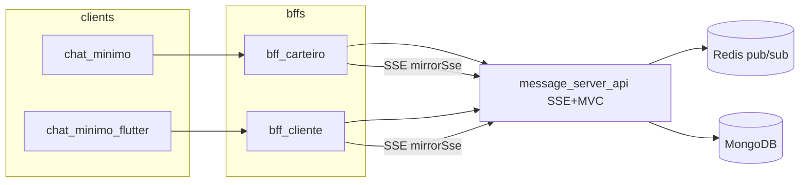

# Plano de refatoração do chat — v3 (SSE + Redis)

Este documento consolida o escopo acordado a partir dos artefatos oficiais:

- **Chat — Refactor Spec v3.0** (`chat_refactor_spec_v3.docx`): arquitetura SSE + Redis, eliminação do `message_server`, ajustes em BFFs e clients.
- **Chat — Modelo de domínio** (`chat_domain_model.docx`): schema MongoDB extensível, `correios.entrega`, endpoints e índices.

O desenho atual dos repositórios demo e dos proxies está em [`ESTRUTURA_CHAT.md`](./ESTRUTURA_CHAT.md) (núcleo **v3** + secção **legado** WS).

### Repositório vs operação

| Escopo | O que está coberto por commits neste ecossistema |
|--------|---------------------------------------------------|
| **Código e docs nos repos** | API (SSE, Redis, REST, índices), BFF/proxy espelhando SSE e histórico, demos **Kotlin e Flutter só SSE + REST** (sem ramo WebSocket nos apps mínimos), exemplo K8s para env Redis (`message-server-api/docs/k8s-redis-env.example.yaml`). |
| **Gates só com deploy/observabilidade** | Redis real no cluster (Fase 1 primeiro item), 48 h sem tráfego WS útil no `message_server`, remoção de `/ws` e upstream no BFF/proxy, scale-down do hub, arquivar repo, apps reais em loja — não marcar como concluído só por merge. |

---

## 1. Objetivos

| Meta | Descrição |
|------|-----------|
| **Canal tempo real** | Substituir WebSocket por **SSE** (HTTP chunked), evitando problemas de timeout de conexões longas em proxies/LB. |
| **Topologia** | Remover o **`message_server`** como hub; eventos servidor → cliente saem da **`message_server_api`**, com **Redis pub/sub** entre pods. |
| **Canal envio** | **REST puro** `POST /chats/{chatId}/messages` (via BFF, proxy transparente). |
| **Domínio** | Modelar **`chats`** e mensagens (coleção **`messages`** na API; spec fala em `chat_messages`) com core + `detalhes`, `chatId` determinístico, batch LOEC, jobs `correios.entrega`. |
| **Confiabilidade** | **Idempotência** por `msgId`; **catch-up** com `GET /chats/{id}/messages?since=`; filas de reenvio nos clients. |
| **Migração** | **Sem downtime forçado** em produção: BFF/proxy e `message_server` podem coexistir até o corte operacional. Os **demos** deste monorepo já estão **SSE-only** (sem feature flag WS nos apps mínimos). |

---

## 2. Arquitetura alvo (resumo)

**Fluxo de mensagem (envio):** client → BFF → API → valida `msgId` → persiste → atualiza preview/unread → publica `chat.events.{userId}` para cada participante → pod com SSE daquele usuário emite evento SSE.

**Fluxo de recebimento:** client abre `GET .../sse/stream?userId=` através do BFF; API assina Redis por `userId` e envia eventos no formato SSE (incluindo keepalive).

---

## 3. Escopo por sistema

### 3.1 Infraestrutura e dados

- Provisionar **Redis** no ambiente (K8s / local).
- **MongoDB:** criar/ajustar índices conforme modelo de domínio e spec v3 (ver seção 6).

### 3.2 `message_server_api`

- Dependência **`spring-boot-starter-data-redis-reactive`** (+ Jackson conforme projeto).
- Configuração `spring.data.redis.*` e prefixo de canal `chat.redis.channel-prefix=chat.events.`.
- **`SseEmitterService`:** `Flux` por `userId` via listener Redis + **keepalive** (~30 s, comentário SSE).
- **`SseController`:** `GET /sse/stream?userId=` (produz `text/event-stream`).
- **`ChatEventPublisher`:** após persistir mensagem, publicar JSON do evento para cada `participants[]`.
- Integrar publicação no fluxo que hoje persiste mensagens (ex.: após consumer `chat.in` / serviço de mensagem).
- **Idempotência:** `saveMessage` (ou equivalente) com verificação de `msgId`; índice único em `msgId`.
- **`GET /chats/{chatId}/messages`:** parâmetro **`since`** (epoch millis) para catch-up incremental; comportamento legado sem `since` mantido onde aplicável.
- **Domínio (modelo de documento):** coleção `chats` com core + `detalhes`; `chatId` via `SHA-256(dominio|externalKey)[0..16]`.
- **`POST /chats`:** criação/upsert idempotente; resposta com `chatId`, `isNew`, etc.
- **`POST /chats/batch`:** upsert em lote (LOEC).
- **`GET /chats`:** filtros `participant`, `dominio`, `status`, paginação; envelope paginado quando `page`/`size` presentes.
- **Jobs agendados** (`correios.entrega`): fechamento 23h55 (dia corrente) e 00h05 (residual); única query em `detalhes` permitida para esses jobs + índice `idx_correios_fechamento`.
- **`chat_messages`:** campos uniformes; índices de histórico, catch-up, `msgId` único, auditoria por `dominio` se necessário.

### 3.3 BFFs (`bff_carteiro` e `bff_cliente`)

- **Sem novas dependências no POM** (spec).
- Em **`GenericProxy`**: adicionar **`mirrorSse()`** (`HttpURLConnection`, pipe de stream, flush por chunk; não usar `RestTemplate` para o corpo).
- Headers de resposta SSE: `Content-Type: text/event-stream`, `Cache-Control: no-cache`, `Connection: keep-alive`, **`X-Accel-Buffering: no`**, `flushBuffer()` após headers.
- Controller: **`@GetMapping("/sse/**")`** delegando ao `mirrorSse` com prefixo `/sse`.
- Propriedade **`proxy.sse.upstream-host`** apontando para o serviço da API no cluster.
- **Dimensionamento:** thread do servlet bloqueada por conexão SSE — ajustar **`server.tomcat.threads.max`** (e réplicas) conforme carga.

### 3.4 `chat_minimo` (Kotlin)

- Transporte tempo real: **`SseManager`** (OkHttp, `readTimeout(0)`, reconexão com backoff + jitter). **`WebSocketManager` removido** no demo; apps corporativos podem manter flag/WS até o corte operacional.
- Contrato em ViewModels: **`SharedFlow` de eventos**, **`StateFlow` de conexão**.
- **Envio:** `POST /chats/{chatId}/messages` com **`msgId`** gerado no client; estados locais (enviando / pendente / enviado); fila de reenvio.
- **Catch-up** ao reconectar SSE: reload lista de chats; se chat aberto, `messages?since=`; drenar fila pendente.

### 3.5 `chat_minimo_flutter`

- Tempo real: **`sse_service.dart`** (pacote `http`, stream linha a linha, buffer multi-linha `data:`). **Sem** `web_socket_channel` no demo.
- **Envio:** REST POST com `msgId` (package `uuid`).
- **Catch-up:** mesmo padrão do spec (lista + mensagens `since` + fila).

### 3.6 Descomissionamento (fase final)

- Monitorar **`message_server`**: zero tráfego WebSocket (ex. 48 h).
- Remover rotas/config WS dos BFFs.
- Desligar deployment do **`message_server`**; arquivar repositório se aplicável.
- Remover feature flag WS na próxima versão estável dos apps.

---

## 4. Contratos principais (referência rápida)

| Item | Contrato |
|------|----------|
| SSE (cliente) | `GET /sse/stream?userId={id}` (via BFF: mesmo path sob prefixo proxy) |
| Envio mensagem | `POST /chats/{chatId}/messages` — body com `msgId`, `sender`, `receiver`, `content`, `timestampMillis` (e demais campos alinhados à API) |
| Catch-up | `GET /chats/{chatId}/messages?since={epochMillis}&size=...` |
| Redis | Canal `chat.events.{userId}` — payload JSON do evento (ex. `chatUpdate`, `chatStatusChanged`, `messageStatus`) |
| SSE wire | Linhas `data: {json}`; eventos separados por linha em branco; comentários `: keepalive` / retry conforme implementação |

---

## 5. Migração e riscos

- **Não desligar** o `message_server` até todos os clients estarem na versão SSE.
- **Rollback:** reativar WS no client; servidor legado ainda disponível durante a janela.
- **Validação pré-corte:** logs API/Redis, `curl -N` no SSE via BFF, testes de catch-up e de idempotência (mesmo `msgId` duas vezes → uma linha no Mongo).

---

## 6. Checklist MongoDB (modelo + spec)

Use esta lista junto com os scripts/migrations do time. Na **message-server-api**, índices declarados em **`@CompoundIndex` / `@Indexed`** com `spring.data.mongodb.auto-index-creation: true` (ex.: `application-local.yml`).

**Coleção de mensagens:** o código usa **`messages`** (entidade `ChatMessage`), não `chat_messages`. O campo persistido de tempo é **`timestamp`** (epoch ms), alinhado ao catch-up `since` na API.

- [x] `chats`: `{ participants: 1, lastMessageMillis: -1 }` — `idx_participants_lastMsg` em `Chat.java`
- [x] `chats`: `{ participants: 1, status: 1, lastMessageMillis: -1 }` — `idx_participants_status_lastMsg`
- [x] `chats`: `{ dominio: 1, status: 1 }` — `idx_dominio_status`
- [x] `chats`: fechamento correios `{ detalhes.dataTentativa: 1, status: 1, dominio: 1 }` — `idx_correios_fechamento`
- [x] `messages`: `{ chatId: 1, timestamp: -1 }` — `idx_messages_chat_ts_desc`
- [x] `messages`: `{ chatId: 1, timestamp: 1 }` (catch-up) — `idx_messages_chat_ts_asc`
- [x] `messages`: único esparso `{ msgId: 1 }` — `@Indexed` em `ChatMessage.msgId`
- [x] `messages`: `{ dominio: 1, timestamp: -1 }` — `idx_messages_dominio_timestamp`; campo **`dominio`** preenchido no **`ChatProcessorService`** a partir do chat

---

## 7. Checklist de implementação (ordem recomendada)

Marque `[x]` conforme for concluindo. A ordem segue o **Refactor Spec v3** (Fases 1–6).

### Fase 1 — Redis e base de dados

- [ ] Redis provisionado e acessível pelos pods da API — variáveis em [`ESTRUTURA_CHAT.md`](./ESTRUTURA_CHAT.md) § Redis em produção / K8s (*checklist operacional do time*). Exemplo de `Secret` + `Deployment` com `envFrom`: [`message-server-api/docs/k8s-redis-env.example.yaml`](../../message-server-api/docs/k8s-redis-env.example.yaml).
- [x] **Docker Compose local:** portas de **host** sem colisão com serviços típicos — `message-server-api/docker-compose.yml`: Mongo **27027**, Redis **16379** (host) → 6379 (container), Rabbit **35672** (AMQP) / **35673** (UI). `message-server/docker-compose.yml`: mesmas portas para mongo/redis/rabbit + Postgres **35432** (host) → 5432 (container). Perfil `local` da API: Redis default **`localhost:6379`**; com Redis *só* do compose, usar **`REDIS_PORT=16379`** (ver `application-local.yml` e `ESTRUTURA_CHAT.md`).
- [x] `spring-boot-starter-data-redis-reactive` adicionado na `message_server_api`.
- [x] `application.yml` / `application-local.yml` com `spring.data.redis.*` e `chat.redis.channel-prefix`.
- [x] **`ChatRedisEventPublisher`** (`publishToParticipants` / `publishToUser`) + integração em **`ChatEventsOutPublisher`**.
- [x] Índices Mongo da **seção 6** declarados nas entidades (`Chat`, `ChatMessage`); validar em ambiente com `auto-index-creation` ou script dedicado.
- [x] Teste manual Redis — exemplo **`SUBSCRIBE`** em [`ESTRUTURA_CHAT.md`](./ESTRUTURA_CHAT.md) § validação.

### Fase 2 — API: SSE, mensagens e domínio

- [x] **SSE (MVC)**: `ChatSseStreamService` + `SseEmitter` + keepalive comentado + `retry` inicial — *stack atual é Tomcat/MVC, não WebFlux `Flux<ServerSentEvent>` do docx*; **`server.tomcat.threads.max: 200`** na API.
- [x] **`SseController`**: `GET /sse/stream?userId=`.
- [x] Publicação Redis nos eventos já emitidos por **`ChatEventsOutPublisher`** (incl. após consumer `chat.in`); **`messageStatus`** também espelhado no Redis para o remetente.
- [x] **Idempotência** `msgId` no consumer **`ChatProcessorService`** (`existsByMsgId` antes de persistir).
- [x] **`GET /chats/{chatId}/messages`**: parâmetro `since` + `size` (catch-up; campo persistido continua `timestamp` na entidade `ChatMessage`).
- [x] **`POST /chats/{id}/messages`**: valida chat + publica JSON em **`chat.in`** (`ChatMessageInboundService`).
- [x] **`POST /chats/{id}/delivery-status`**: enfileira **`messageStatus`** no **`chat.in`** (clientes SSE / REST).
- [x] **`ChatIdGenerator`** + campo **`dominio`** em `Chat`, **`dataTentativa`** em `ChatDetalhes`; **`POST /chats`** idempotente (upsert por `chatId` derivado; resposta **`ChatUpsertResponse`** com `chatId`, `id`, `isNew`, `dominio`, `detalhes`).
- [x] **`POST /chats/batch`** (+ BFF **`POST /chat/sessoes/batch`**); ordem da resposta = ordem do request.
- [x] **`GET /chats`**: query params (`participant`, `dominio`, `status`, paginação) + envelope paginado quando `page`/`size` presentes; sem `participant` mantém lista legado por `limit`.
- [x] **`CorreiosEntregaCloseScheduler`**: jobs 23h55 (dia corrente) e 00h05 (residual) para `correios.entrega` — flag `app.chat.correios-entrega.scheduler.enabled` (default `false` em `application.yml`).
- [x] Teste **`curl -N`** no SSE — exemplos em [`ESTRUTURA_CHAT.md`](./ESTRUTURA_CHAT.md) § validação (execução manual no ambiente).

### Fase 3 — BFF (carteiro e cliente)

- [x] Encaminhamento SSE **`MessageServerSseMirror`** (`HttpURLConnection` + flush), espelhando **`app.messageserver-api.url`** (equivalente ao `mirrorSse` do spec; não foi no `GenericProxy` de frota).
- [x] Rota **`GET /sse/**`** em **`ChatSseProxyController`** (`appoperacional-bff-main`).
- [x] **`POST /chat/sessoes/{id}/messages`** (e `/sessions/...`) + **`since`/`size`** no GET de mensagens no **`ChatHistoryProxyController`**.
- [x] **`GET /chat/sessoes`** encaminha para **`GET /chats`** (participant, dominio, status, page, size, limit).
- [x] **`server.tomcat.threads.max: 200`** em `application.yaml` do BFF operacional.
- [x] **proxyapp**: **`MessageServerSseMirror`** + **`ChatSseProxyController`** (`GET /sse/**`) + **`/sse/**`** em `AppURLAuthorizer`; **`ChatHistoryProxyController`** alinhado ao BFF (lista sessões, `since`/`size`, POST mensagens, `delivery-status`, batch); **`server.tomcat.threads.max: 200`** em `application.yaml`.
- [x] Teste **`curl -N`** no BFF/proxy — mesmo § em [`ESTRUTURA_CHAT.md`](./ESTRUTURA_CHAT.md); header **`X-Accel-Buffering: no`** é definido pelo espelho SSE (`MessageServerSseMirror`).

### Fase 4 — Client Kotlin (`chat_minimo`)

- [x] **`SseManager.kt`** (OkHttp, `readTimeout(0)`, reconexão backoff + jitter) + registro em **`ChatApplication`**.
- [x] Demo **só SSE + REST**: **`WebSocketManager` removido**; sem **`BuildConfig.USE_SSE`** / ramos WS no app mínimo.
- [x] Envio: **`ChatMutationApi.postChatMessage`** → BFF **`POST /chat/sessoes/{id}/messages`**; fila **`ChatSseOutboundQueue`** + **`drainPendingOutbound()`** ao abrir stream.
- [x] **`performCatchUp()`**: `POST /chat/historico` (lista) + **`GET .../messages?since=`** no chat aberto; se **não** houver `since` (lista vazia) → **`GET .../messages?size=`** (histórico completo até o limite).
- [x] **`postDeliveryStatus`** (visualizada) → **`POST .../delivery-status`** (API + BFF).
- [x] **`ChatViewModel`** + **`ChatViewModelFactory`**: transporte SSE, catch-up, envio, eventos tempo real; **`MainActivity`** só Compose + wiring.
- [x] Testes JVM: merge catch-up / timestamps em **`ChatHistoryApi`** (`ChatHistoryApiTest`); fila SSE **`ChatSseOutboundQueue`** (`ChatSseOutboundQueueTest`).
- [x] Cobertura automática de **dedupe por `msgId`** no merge de catch-up (evita duplicar linhas na UI se o servidor reenviar o mesmo id).
- [ ] Testes manuais: reconexão SSE, catch-up E2E, reenvio após falha de rede (além dos unitários acima).

### Fase 5 — Client Flutter (`chat_minimo_flutter`)

- [x] **`lib/sse_service.dart`** implementa **`ChatRealtimeService`** (único transporte tempo real no demo).
- [x] **`uuid`** no projeto; sem feature flag WS / **`chat_feature_flags`** no app mínimo.
- [x] **`ChatHistoryApi`**: `postChatMessage`, `postDeliveryStatus`, `fetchMensagens(since, size)`, `normalizeMessageRow`.
- [x] **`performCatchUp()`** + fila **`ChatSseOutboundQueue`** ao abrir stream SSE; lista via notifier + merge; incremental com `since` ou carga inicial sem `since` quando `messages` vazio (reconexão SSE); **`ChatListPage`** reinstala `onStreamOpen` ao voltar da conversa (`reattachListSseHandler`) para recarregar histórico na reconexão.
- [x] Dependência **`web_socket_channel`** removida do demo.
- [x] Testes unitários: `normalizeMessageRow`, `maxTimestampMillis`, `mergeCatchUp` (`test/chat_history_api_test.dart`); **`ChatSseOutboundQueue`** (`test/chat_sse_outbound_queue_test.dart`); catch-up em **`chat_page`** alinhado ao Kotlin.
- [x] Dedupe por `msgId` no `mergeCatchUp` (paridade com testes JVM do Kotlin).
- [ ] Testes manuais: reconexão SSE e fluxo completo (equivalente ao que falta no Kotlin).

#### Demos vs apps reais

Os repositórios **`chat_minimo`** e **`chat_minimo_flutter`** (demos mínimos) usam **apenas SSE + REST**. Coexistência WS + feature flags permanece documentada na **Fase 6** e na infraestrutura (BFF, proxyapp, `message_server`) até o corte operacional; **apps corporativos** fora destes repos seguem o rollout do time (versões, lojas, métricas).

### Fase 6 — Descomissionamento e limpeza

- [x] **Dev local sem hub:** `application-local` do **BFF** e do **proxyapp** com `app.websocket.enabled: false` e `app.websocket.gateway.enabled: false` — stack **SSE-only** sem subir `message_server` (em **DES/HOM/PRD** o default em `application.yaml` mantém WS até o corte operacional).
- [ ] Métricas/logs: **zero** roteamento útil no `message_server` (período acordado, ex. 48 h).
- [ ] Confirmado SSE e Redis em produção (volume e erros aceitáveis).
- [ ] Remover config/proxy WebSocket do **BFF** e do **proxyapp** (tabela *Referência para corte* nesta fase).
- [ ] Desligar deployment **`message_server`**.
- [ ] Arquivar repo **`message_server`** (se política do time).
- [ ] Remover feature flag / ramos WS nos **apps reais** (fora dos demos já SSE-only) na versão seguinte.
- [x] **`ESTRUTURA_CHAT.md`** reescrito com **arquitetura v3** como núcleo e secção **legado** (`message_server` / WS) para coexistência até o corte.

#### Referência para corte WebSocket / `message_server` (*só após tráfego útil zero — ex. 48 h*)

| Sistema | O que desligar / revisar |
|---------|---------------------------|
| **BFF operacional** (`appoperacional-bff-main`) | `application.yaml`: `app.websocket` (`enabled`, `path: /ws`, `app.websocket.gateway.url` → hub legado). Código: `service/chatws/` (`GatewayWebSocketProxy`, handlers), auto-config WebSocket do módulo compartilhado. |
| **proxyapp** | `application.yaml`: `app.websocket` (mesmo padrão). Segurança: `AppURLAuthorizer` — matcher `/ws/**` (manter ou remover em conjunto). |
| **message-server** | Deployment do hub que expõe `GET /ws?userId=` (porta conforme ambiente, ex. `8081` em local). |
| **Demos** (estes repos) | Concluído: Kotlin e Flutter **só SSE**; sem `USE_SSE` / `web_socket_channel` nos apps mínimos. |

**Sinais de “zero tráfego útil”** (adaptar à observabilidade do time): nenhuma nova sessão WebSocket de app real nos logs do BFF/proxy encaminhando ao `message_server`; versões estáveis dos apps com SSE em produção; métricas de erro/latência SSE e Redis dentro do aceitável.

**Ordem sugerida após confirmação:** (1) 100% dos clients em SSE nas lojas internas; (2) feature flags fixas SSE + remoção gradual da rota `/ws` e do upstream no BFF/proxy; (3) scale-to-zero ou desligar `message_server`; (4) limpar código WS nos apps (`web_socket_channel`, ramos legados).

---

## 8. Itens fora do escopo imediato (roadmap)

- Migração dos BFFs para **Spring Cloud Gateway** (WebFlux) para proxy SSE sem bloquear thread por conexão — mencionado no spec como evolução.

---

*Documento gerado para acompanhamento da branch de refatoração; ajuste datas e donos de tarefa no board do time conforme necessário.*
